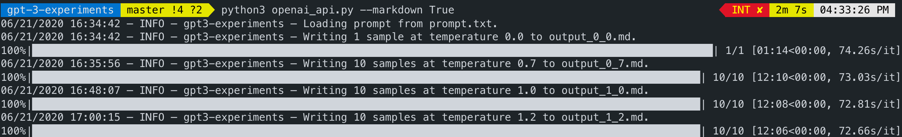

# gpt-3-experiments

A repo containing test prompts for [OpenAI](https://openai.com)'s [GPT-3](https://www.zdnet.com/article/openais-gigantic-gpt-3-hints-at-the-limits-of-language-models-for-ai/) [API](https://openai.com/blog/openai-api/) and the resulting AI-generated texts, which both illustrate the model's robustness, plus a Python script to quickly query texts from the API. All generated texts in this repo are _completely unedited and uncurated_ unless explicitly stated otherwise.

**Disclaimer: generated text content in this repository may be offensive. The READMEs of the corresponding examples will include an explicit content warning (CW) when this is the case.**

## Repo Layout

This repo contains folders for each prompt example in the `/examples` folder. The README for each prompt example contains the input and any content warnings as noted above.

All texts were generated from the best `davinci` model. Specifically, after feeded the prompt, 1 text was generated (at up-to-512 tokens per text) at `temperature=0.0` (i.e. the model will always choose the most likely output and is therefore deterministic), and 10 texts for each temperature of 0.7, 1.0, and 1.2: the higher the temperature, the more "creative" the text.

## Script Usage



If you have access to the OpenAI API, you can use the `openai_api.py` Python script to gather generated texts faster than using the web interface.

First, download/clone the repo, and in the `config.yml`, set the `SECRET_KEY` to the one provided to you by the OpenAI API. (do not share with anyone!)

The script (Python 3.6+) requires the installation of certain Python packages:

```sh
pip3 install httpx pyyaml fire tqdm
```

After that, you can run it from the command line. For example, if you wanted to generate text with the prompt "Once upon a time", you could do:

```sh
python3 openai_api.py "Once upon a time"
```

This will generate a file for each specified `temperature` in the `config.yml`.

If you want to read a longer text from a file (e.g. `prompt.txt`, the default behavior), you can put that prompt in that file and run:

```sh
python3 openai_api.py "prompt.txt"
```

By default, the output files are _Markdown_ files, which allows them to include the prompt bolded and render better on GitHub. To save the output files as text instead (w/o the prompt), set:

```sh
python3 openai_api.py "prompt.txt" --markdown False
```

## Notes

- The script uses synchronous requests by default with a 30 second sleep between requests: apparently the async approach which requested all generated texts simultaneously caused too much of a strain on OpenAI's infrastructure. Please uses that default for the time being.

## Maintainer/Creator

Max Woolf ([@minimaxir](https://minimaxir.com))

_Max's open-source projects are supported by his [Patreon](https://www.patreon.com/minimaxir) and [GitHub Sponsors](https://github.com/sponsors/minimaxir). If you found this project helpful, any monetary contributions to the Patreon are appreciated and will be put to good creative use._

## License

MIT

## Disclaimer

This repo has no affiliation with OpenAI.
